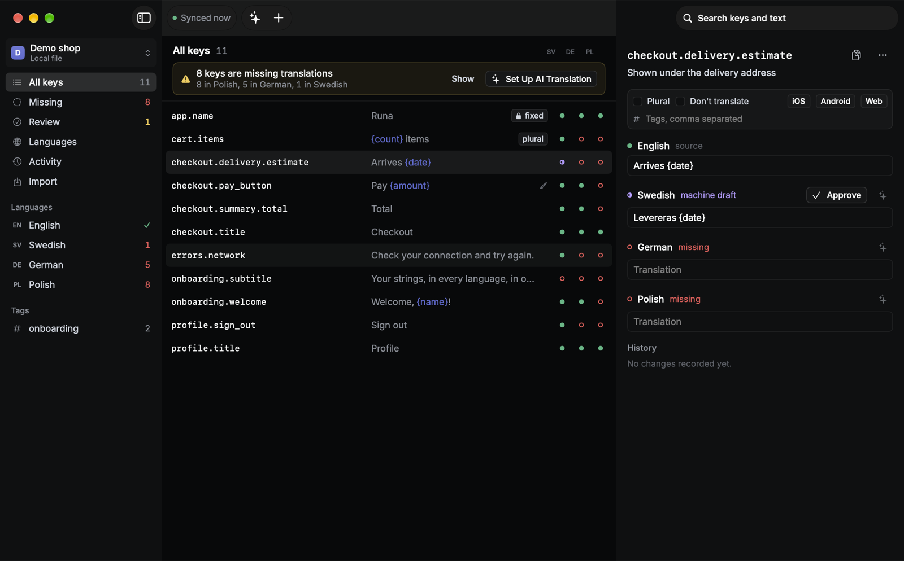
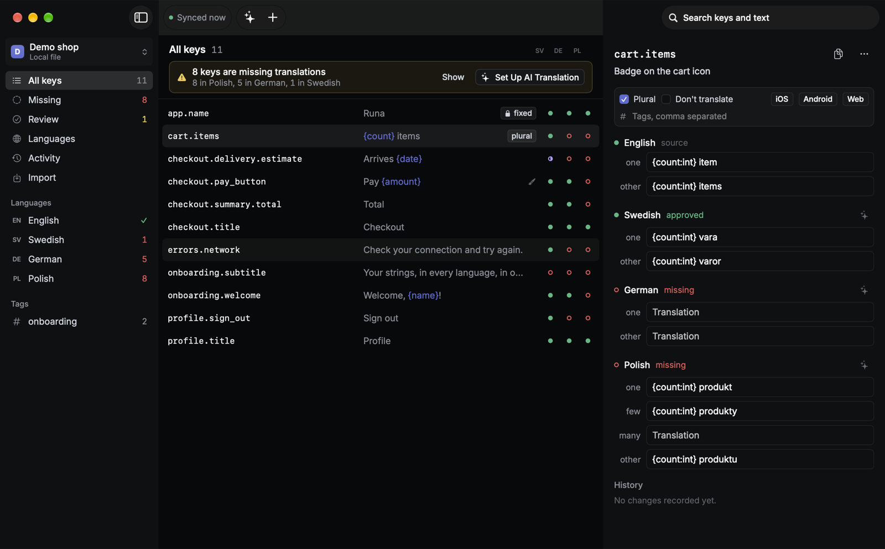
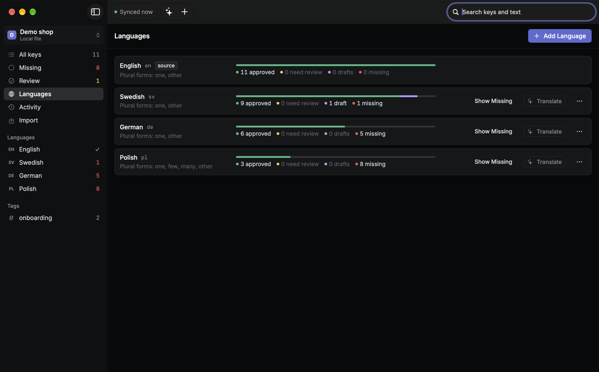

# Runa

Runa keeps the UI strings of your iOS, Android and web apps in one place you own, links them to
your Figma designs, and drafts translations with the AI provider you already use.



- **Bring your own backend.** Strings live in a Google Sheet you own (or a local `.runa.json`
  file). There is no Runa server and no Runa account.
- **Runa for Mac.** Search, add, edit and delete keys. Add and remove languages. See at a glance
  what is missing, review machine drafts, import existing strings files with conflict review, and
  follow every change in the activity log.
- **Figma plugin.** Select text, give it a key, push it. The link and the design context (screen,
  layer path, size, nearby texts) travel with the key.
- **AI translation with context.** Claude, OpenAI, Gemini, or a local model through Ollama or
  LM Studio. Each string is sent with its description, Figma context and a screenshot of the frame.
  Placeholders and plural forms are checked before anything is saved, and every draft waits for a
  person to approve it.
- **`runa` CLI and MCP server.** `runa pull` writes String Catalogs, Android `strings.xml` and web
  JSON into your repository; you commit as usual. `runa check` fails CI on missing translations.
  `runa mcp` lets Claude Code and other agents look up and add strings while they write code.

| | |
|---|---|
|  |  |

## Contents

- [Install](#install)
- [Connect a Google Sheet](#connect-a-google-sheet)
- [Translate with AI](#translate-with-ai)
- [Get strings into your apps](#get-strings-into-your-apps)
- [Figma plugin](#figma-plugin)
- [How it works](#how-it-works)
- [Develop](#develop)

## Install

**Mac app.** Download `Runa.dmg` from the [latest release](../../releases/latest), or build it:

```sh
git clone https://github.com/alexnorrman/runa.git
open runa/Apps/Runa/Runa.xcodeproj   # then Product → Run
```

Requires macOS 15 or later; built and tested with Xcode 27. If the release is not notarized, right-click Runa.app →
Open the first time. Try it without any setup from the welcome screen: **Explore a Demo Project**.

**Command line.** In Runa, open Settings → Command Line → Install. That links the bundled `runa`
into `~/.local/bin`. Or build it: `swift build -c release --product runa` and copy
`.build/release/runa` onto your `PATH`.

## Connect a Google Sheet

Runa talks to Google with a **service account**: a robot Google account you create once and share
your sheet with, like a colleague. It needs no OAuth app and no verification by Google.

1. In the [Google Cloud console](https://console.cloud.google.com/), create a project (or pick one).
2. Enable the **Google Sheets API** for it (APIs & Services → Library).
3. Create a **service account** (IAM & Admin → Service Accounts). It needs no roles.
4. On the service account, open **Keys → Add key → Create new key → JSON**. A file downloads.
5. In Runa, **Add Project → Google Sheet → Add Key File** and pick that file. It goes into your
   Keychain. Runa shows the account's email address.
6. Create a sheet (or use an existing one), click **Share**, and add that email address as an
   **Editor**.
7. Paste the sheet's link into Runa and press **Connect**. Runa lays out an empty sheet, or adds
   its columns to an existing `strings` tab without touching your data.

Translators can keep working in the sheet directly: one row per key, one column per language.
Adding a language is adding a column. The hidden tabs hold review status, Figma links and history;
[docs/SHEET_FORMAT.md](docs/SHEET_FORMAT.md) describes every column. Want a starting point?
Import [templates/runa-sheet-template.csv](templates/runa-sheet-template.csv) into a new sheet.

Removing the service account from the sheet's sharing settings cuts off every Runa client at once.
Never commit the key file.

## Translate with AI

Settings → AI: pick a provider, paste an API key, press **Load Models**, then **Save**.

| Provider | Notes |
|---|---|
| Claude (default `claude-opus-5-5`) | Structured JSON output, effort `medium` by default, server-side fallback so a declined batch is retried on another Claude model, screenshots as image input. |
| OpenAI | Responses API with strict JSON schema output and image input. |
| Gemini | `generateContent` with a response schema and image input. |
| OpenAI-compatible | Ollama (`http://localhost:11434/v1`), LM Studio, OpenRouter, Mistral, Groq. Screenshots off by default. |

Translate from the banner ("8 keys are missing translations → Translate"), from a language's row,
from the ✦ button next to any language of a key, or with ⇧⌘T. Runa shows the number of requests,
an estimate of tokens and, for Claude, the cost before anything is sent.

Each string goes out with its description, plural forms the language needs, placeholders,
translations that already exist in other languages, where it sits in Figma, nearby texts on the
same screen, and the screen's width. Add a glossary and per-language style guides (formal or
informal, tone) in Project Settings. Results are validated: missing or invented placeholders and
missing plural forms are sent back to the model once, then reported if still wrong. Drafts land as
**machine drafts**; open **Review** (⇧⌘R) to approve them with ⌘↩.

To render screenshots, add a Figma personal access token in Settings → Figma (read-only file
content scope is enough).

## Get strings into your apps

Commit a `runa.yml` next to your code (`runa init` writes a commented one):

```yaml
backend:
  type: google-sheets
  spreadsheet: https://docs.google.com/spreadsheets/d/1AbC…/edit
targets:
  - format: xcstrings          # iOS String Catalog
    path: App/Localizable.xcstrings
  - format: android            # res/ folder
    path: app/src/main/res
  - format: i18next            # web, one file per language
    path: public/locales
    file: "{locale}/translation.json"
    nested: true
approvedOnly: false
```

```sh
runa pull             # write every target; review the diff and commit
runa check            # exit 1 when a key is missing in any language
runa check --approved # also fail on drafts and translations that need review
runa keys search pay  # fuzzy search over keys and text
runa keys add settings.title --text "Settings" --description "Title of the settings screen"
runa import app/src/main/res --dry-run   # bring existing strings files in, with a conflict report
runa locales add de
```

Formats: String Catalogs (`.xcstrings`, byte-identical to what Xcode writes), `.strings` +
`.stringsdict`, Android `strings.xml` with `<plurals>`, i18next JSON (flat or nested) and ICU
MessageFormat JSON. Placeholders are written once as `{name}`, `{count:int}` or
`{price:double.2}` and become `%@`/`%lld`, `%1$s`/`%1$d`, `{{name}}` or `{name}` per platform.

**Credentials for the CLI.** `RUNA_GOOGLE_CREDENTIALS` (a path or the JSON itself), or
`credentials:` in `runa.yml`, or `~/.config/runa/google-service-account.json`, which the Mac app
writes from Settings → Command Line.

**CI.** Use the action in this repository:

```yaml
- uses: alexnorrman/runa@v0
  with:
    command: check
  env:
    RUNA_GOOGLE_CREDENTIALS: ${{ secrets.RUNA_GOOGLE_CREDENTIALS }}
```

**MCP.** `claude mcp add runa -- runa mcp`. Tools: search, get, add, update source text, propose
a translation (saved as a draft), delete, list languages, check and pull. The server tells the
agent to reuse existing keys before adding new ones.

## Figma plugin

See [figma-plugin/README.md](figma-plugin/README.md). In short: build it, then in Figma desktop
choose Plugins → Development → Import plugin from manifest and pick `figma-plugin/manifest.json`.
Paste the sheet link and the same service account key into the plugin once. The plugin only works
with the source language; everything else happens in the Mac app.

## How it works

```
Figma plugin ─┐                                   ┌─ AI provider of your choice
runa CLI/MCP ─┼─▶ Google Sheet or .runa.json ◀────┤
Runa for Mac ─┘     (the only server)             └─ Figma REST API for screenshots
```

- **One model, many formats.** `RunaCore` holds keys, translations, plural forms and placeholders
  in one canonical form; each platform format is a converter with round-trip tests.
- **Intent-based sync.** Clients send changes ("set Swedish of `checkout.title` to …"), not
  whole tables. A change to a cell someone else edited since you pulled comes back as a conflict
  instead of overwriting their work. Writes to a sheet are one atomic `batchUpdate`.
- **Status without bookkeeping.** Each translation records a hash of the source text it was
  approved against. Edit the source and every translation of it shows *needs review*, even if
  someone edited the source straight in the sheet.
- **History.** Google's version history covers the whole sheet; the `_history` tab records every
  change per key (who, what, before, after, and where it came from: app, CLI, import, AI or Figma);
  git records what shipped.

The full design is in [docs/PLAN.md](docs/PLAN.md).

## Develop

```sh
swift test                         # core: formats, backends, AI providers (80+ tests)
swift build --product runa         # CLI
open Apps/Runa/Runa.xcodeproj      # app; regenerate with `xcodegen` after editing project.yml
cd figma-plugin && npm install && npm test && npm run build
```

`Apps/Runa/project.yml` is the source of truth for the Xcode project. Debug builds accept
`--demo` to start with the demo project and `--snapshots <dir> [--dark]` to render each screen to
PNG.

## License

MIT. Inter is © The Inter Project Authors, under the SIL Open Font License
(`Sources/RunaDesign/Resources/Fonts/OFL.txt`).
